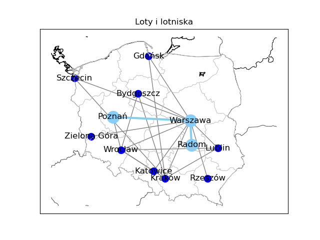

# Basemap Graph Example
Use of networkx and basemap in one project. My code generates map whith all existing in my xlsx file connections. I choose start point and destination. Program finds it, and hihglight this particular path. In terminal it prints time which is converted to decimal system, and path.
In g_Project.py I demonstrate code that can draw a networx Graph on the matplotlib Basemap map. Since I am from Poland it was obvious for me to choose Poland.
The program takes data from 'miasta.xlsx' (miasta = cities) which are presented in praticualr order:
* City (Warszawa = Wasraw is the main node because it is capital city and from all of mentioned cities there are connections to there)
* Geo position which x is longtitude and y is latitude
* Time of travel from Warszawa (Warsaw) to coresponding city
* Time of travel from Kraków (Cracow) to coresponding city
* Time of travel from Wrocław (Wroclaw) to coresponding city

### Installing Basemap
It isnt such simple thing. For inexperienced which I really am I recommend this tut --> [Instalation tut](https://www.youtube.com/watch?v=mwgnYW3RnhI)

### Programming
To obtain basic knowledge how basemap works I recommend --> [this](https://www.youtube.com/watch?v=6GGcEoodLNM)
And a little bit of stackoverflow of course :)
I also put comments in my code so it would be easier to understand what basemap is.

### My map

